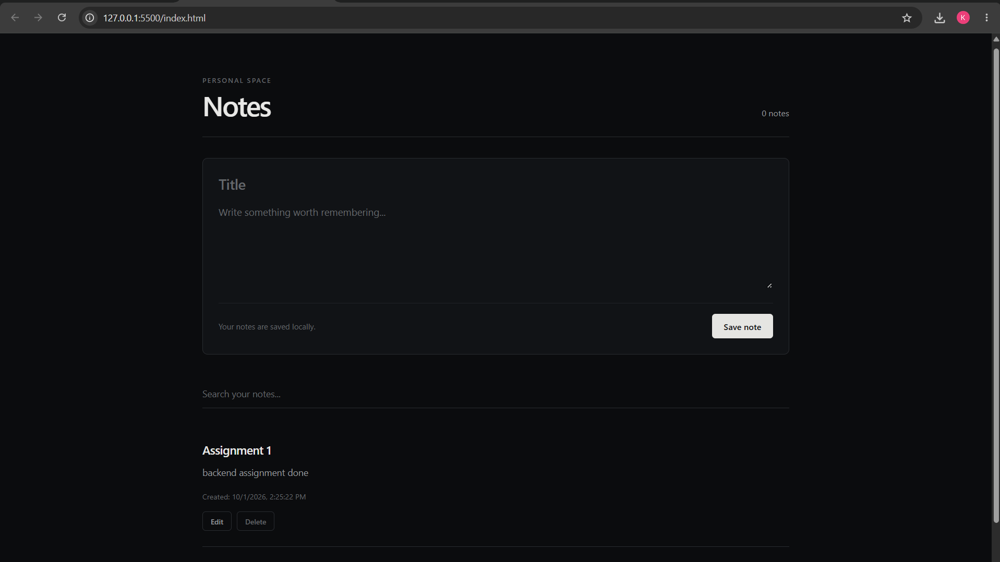

# Notes App

A minimal, dark-themed Notes App built using **HTML, CSS, and JavaScript**. The application allows users to create, search, edit, and delete notes while storing the data persistently in the browser using **LocalStorage**.

## Features

- Create and save notes
- Edit existing notes
- Delete notes
- Search notes by title or content
- Persistent data storage using LocalStorage
- JSON-based data handling
- Automatic date and time for each note
- Notes remain available after refreshing or reopening the browser
- Responsive design for desktop and mobile devices
- Minimal dark-themed user interface
- No external libraries or frameworks required

## Technologies Used

- **HTML5** — Structure of the application
- **CSS3** — Styling, layout, responsive design, and dark theme
- **JavaScript** — Application logic and DOM manipulation
- **LocalStorage API** — Persistent browser-side storage
- **JSON** — Converting and storing JavaScript objects

## Project Structure

```text
notes-app/
│
├── index.html
├── style.css
└── script.js
```

### `index.html`

Contains the structure of the Notes App, including:

- Application header
- Note creation form
- Title input
- Note content area
- Save button
- Search field
- Notes display section

### `style.css`

Contains the complete visual design of the application:

- Dark theme
- Typography
- Layout
- Input styling
- Buttons
- Note cards
- Responsive design
- Focus and interaction states

### `script.js`

Handles the application's functionality:

- Adding notes
- Displaying notes
- Editing notes
- Deleting notes
- Searching notes
- Saving data to LocalStorage
- Retrieving data from LocalStorage
- JSON conversion

## How LocalStorage Works

The application uses LocalStorage to store notes directly in the user's browser.

When notes are saved, the JavaScript array is converted into a JSON string using:

```javascript
JSON.stringify(notes);
```

The JSON string is then stored using:

```javascript
localStorage.setItem("notes", JSON.stringify(notes));
```

When the application loads, the stored JSON data is retrieved and converted back into a JavaScript array:

```javascript
JSON.parse(localStorage.getItem("notes"));
```

This allows the notes to remain available even after refreshing or closing the browser.

## Note Data Format

Each note is stored as an object containing:

```javascript
{
    id: 123456789,
    title: "Example Note",
    content: "This is an example note.",
    date: "10/1/2026, 2:30:00 PM"
}
```

## How to Run

1. Download or clone the project.
2. Open the project folder.
3. Open `index.html` in a web browser.
4. Create a note using the title and content fields.
5. Click **Save note**.
6. Refresh the page to verify that the note is stored persistently.

No server or database is required.

## Application Workflow

```text
User creates a note
        ↓
JavaScript creates note object
        ↓
Note added to notes array
        ↓
JSON.stringify()
        ↓
LocalStorage
        ↓
Notes displayed on the page
```

When the application is reopened:

```text
LocalStorage
      ↓
JSON.parse()
      ↓
Notes array
      ↓
Display notes
```

## Learning Objectives

This project demonstrates the practical use of:

- Browser LocalStorage
- JSON data handling
- JavaScript arrays and objects
- DOM manipulation
- Event handling
- CRUD operations
- Search and filtering
- Responsive web design

## Limitations

- Notes are stored only in the current browser.
- Clearing browser storage will remove the saved notes.
- Notes are not synchronized between different devices or browsers.
- No backend server or database is used.

## Conclusion

The Notes App demonstrates how a simple web application can manage and persist user-generated data using **JavaScript, JSON, and the browser's LocalStorage API**. It provides basic CRUD functionality with a clean, responsive interface while keeping the implementation lightweight and dependency-free.

## Screenshots

